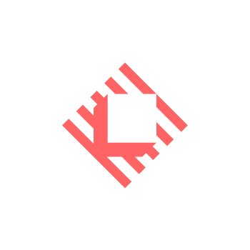

    
    <h1>raycast-extensions</h1>

Home of **dev99problems'** `raycast` **extensions**

## Raycast
[raycast app](https://www.raycast.com/) is the tool, that can be described as `Spotlight` on steroids.
It is **simple**, **flexible**, does not require any **~~paid subscription~~** and has huge amount of different extensions 
to control Spotify, search open tabs in any browser, switch Figma projects, etc.

So `this repo` is a home for my personal `extensions`, which I use on daily basis. Nothing huge,
just the small simple things, which `make my life easier`.

## List of Extensions
### lobsters (Published to Store)
A short and simple way to read https://lobste.rs home page posts,
can be found in [Store](https://www.raycast.com/dev99problems/lobsters) 

## Related Links
The official docs for developer's program of **raycast** is [here](https://developers.raycast.com/)
